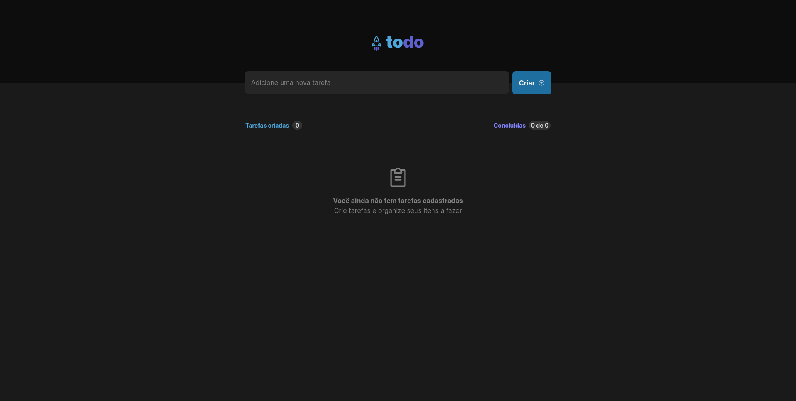

## TODO List Challenge
#### This was a "simple" to do list sent by rocketseat as a challenge (and it was a challenge indeed). Using React, Tailwind, Typescript, concepts of Immutability, Iteration, among other react bases, I managed to complete it after a few hours.

### Previews


<hr>

<hr>


### If you want to have this in your project or just have fun modifying

```git
git clone https://github.com/cayke1/todoList.git
```

```
npm i | yarn
```

#### Have fun

##### Link to app <a href="https://todo-list-roan-ten.vercel.app/">here</a>
